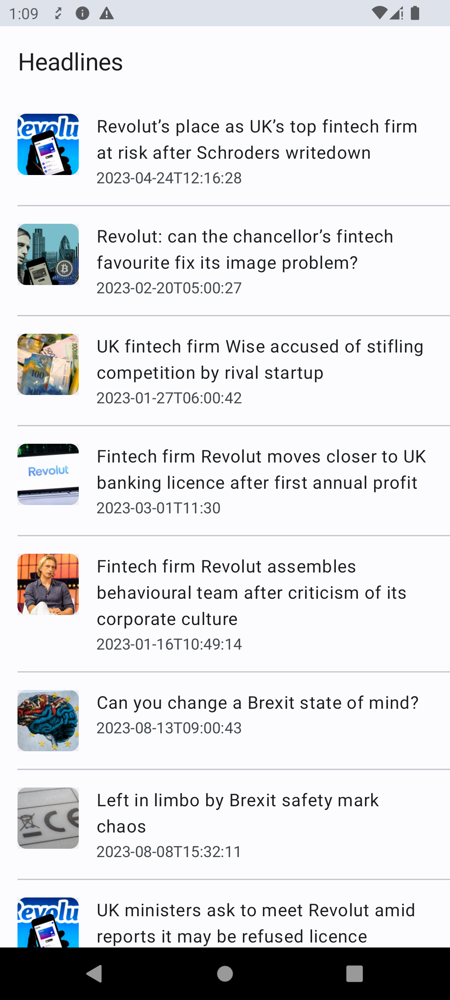
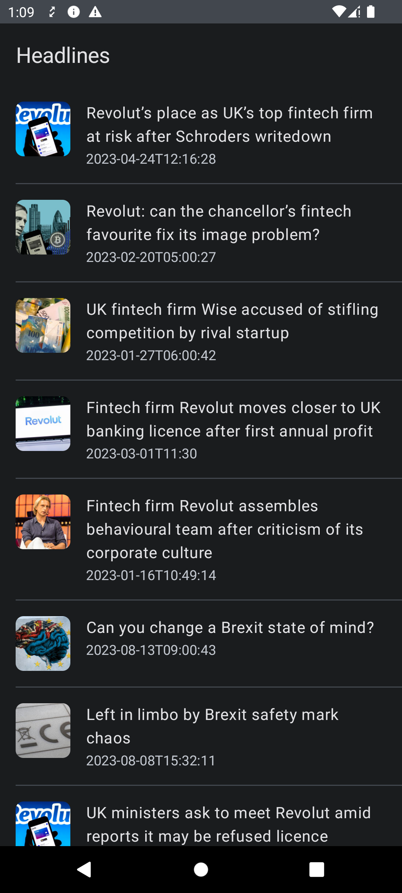

# Monzo Pairing Test for Android Engineers

Thank you for taking the time to interview with us! We're excited to spend some time working through
this project together.

## Before the session

Feel free to spend as long as you like reading the code, but please don't make any significant
changes - we'd like to start the pairing excercise from the default project state.

Make sure you can get it running in the latest stable version of Android Studio. If you see any
build errors, feel free to make changes to build files or dependencies to make sure the project runs
on your laptop.

We will ask you to screen share using Google Meet during the call, so please make sure those system
permissions are set up ahead of time.

At the start of the pairing session, we will detail a couple of tasks for us to work together on.
These tasks will involve updating the UI and ViewModel to extend the functionality of the app. 

**This is not a memory test** so don't worry about remembering function names or how to use certain
APIs, you'll be able to look things up on the web and ask questions.

### Choose between Compose and Android views

You can choose to do the tasks in Jetpack Compose or regular Android views. If you have some
experience with Compose it'll generally be faster to complete the tasks. If you prefer regular
Views that is also okay.

There are two Activities that implement the same UI:

* `ArticlesActivity`: UI is built in Compose (default one)
* `ArticlesActivityViews`: Same UI built with Views

**Note**: if you're going to use Views, update the AndroidManifest file so it points
to `ArticlesActivityViews`

## The App

This is a simple project with a single screen that fetches a list of articles from The Guarding API
and displays them on a list. It uses Kotlin, Compose, RxJava, Retrofit and Material 3.

> [!Note]
> If articles fail to load you might need to replace the Guardian API key. Please
> go [here](https://bonobo.capi.gutools.co.uk/register/developer) and register as a developer to
> obtain a key.

| Current UI (light)                                         | Current UI (dark)                                        |
|------------------------------------------------------------|----------------------------------------------------------|
|  |  |
